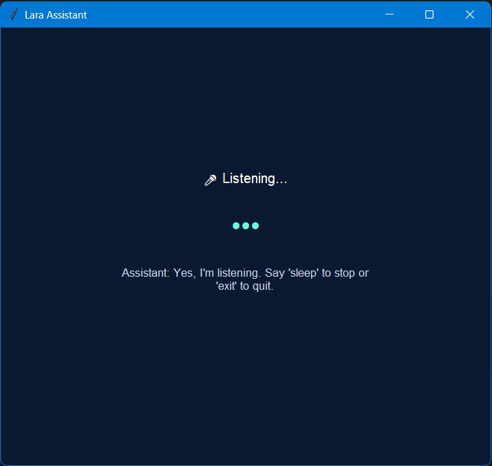

# 🎙 Lara - Your Personal Voice Assistant

Lara is a cross-platform intelligent voice assistant built using Python. It listens to your commands and performs tasks like playing music, opening applications, telling jokes, reading news, setting alarms, and more—all through natural voice commands.

---

---
## 🚀 Features

- Voice-activated assistant with GUI using Tkinter
- Speech recognition using speech_recognition
- Text-to-speech using pyttsx3
- Smart commands:
  - Open local and web apps
  - Email sending
  - System control (volume, brightness, minimize/maximize)
  - News reading via RSS
  - Screenshot capturing
  - File/folder creation
  - Telling jokes, IP check, and more
- Alarm system
- Wake word: *"Lara"*

---

## 🧰 Requirements

### Python Packages

- speechrecognition
- pyttsx3
- pyaudio
- plyer
- feedparser
- psutil
- wmi (Windows only)
- requests
- pillow
- pyautogui
- playsound

Install all packages using:

bash
pip install -r requirements.txt

---

## 💻 Installation Instructions

### 🔁 Clone the Repository

bash
git clone https://github.com/your-username/voice-assistant-lara.git
cd voice-assistant-lara

---

### 📦 OS-Based Setup

#### 🪟 Windows

bash
pip install -r requirements.txt

#### 🐧 Linux

bash
sudo apt-get install python3-tk python3-pyaudio vlc
pip install -r requirements.txt

#### 🍎 macOS

bash
brew install python-tk portaudio vlc
pip install -r requirements.txt

---

### ▶ Running the Assistant

After installation, run the assistant:

bash
python main.py

Make sure your microphone is working. Say *"Lara"* to activate her.

---

## 🧪 Sample Commands

- “What is the time now?”
- “Open Chrome”
- “Search Google for Python tutorials”
- “Search YouTube”
- “Set alarm for 08:30”
- “Tell me a joke”
- “Take screenshot”
- “Create folder”
- “Increase volume”
- “Send an email”

---

## 📁 Project Structure

voice-assistant-lara/
├── main.py
├── music/
├── memory.txt
├── requirements.txt
└── README.md

---

## 🔐 Gmail Setup (for Email Feature)

1. Enable *2-Step Verification* in your Gmail account.
2. Generate an *App Password* from [Google App Passwords](https://myaccount.google.com/apppasswords).
3. Replace the credentials in main.py:

python
EMAIL = "your-email@gmail.com"
PASSWORD = "your-app-password"

> ⚠ *Warning:* Never share your credentials publicly. Use environment variables or secure vaults for production.

---

## 🤝 Contributing

Pull requests are welcome! Feel free to:

- Fix bugs
- Improve the UI
- Add new features or commands
- Optimize performance

---

## 📜 License

This project is open-source and available under the [MIT License](LICENSE).
